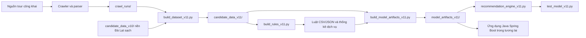

# Cấu trúc project KPDL - Model luật kết hợp v11

## 1. Mục tiêu project

Project xây dựng model luật kết hợp đa điểm đến cho đề tài:

> Sử dụng luật kết hợp để ứng dụng đề xuất tour du lịch.

Model v11 hỗ trợ ba nhóm gợi ý:

1. Địa điểm tiếp theo dựa trên địa điểm đã chọn.
2. Dịch vụ thường đi kèm với địa điểm hoặc dịch vụ đã chọn.
3. Tour cơ bản phù hợp với bộ địa điểm và dịch vụ người dùng quan tâm.

Model hiện tách riêng dữ liệu và luật theo từng destination:

| `destination_key` | Tên hiển thị | Trạng thái |
|---|---|---|
| `da_lat` | Đà Lạt | `ready` |
| `phan_thiet` | Phan Thiết / Mũi Né | `ready` |
| `vung_tau` | Vũng Tàu | `ready` |

`ready` nghĩa là dữ liệu đủ tốt để sử dụng mặc định. `limited` nghĩa là đã có dữ liệu và gợi ý hữu ích nhưng vẫn cần cảnh báo vì độ phủ chưa cao. Model không trộn transaction hoặc luật giữa các destination.

## 2. Luồng xử lý tổng quát



Nguồn dữ liệu hiện có:

- `dalattrip`
- `ivivu`
- `saigontourist`
- `vietfuntravel`
- `vietnambooking`
- `intour`
- `saigontravel`
- `phusitravel`

Dữ liệu được lấy từ lịch trình tour công khai, không phải hành vi đặt tour thực tế của người dùng.

## 3. Cây thư mục root

```text
KPDL/
├── .venv/
├── archive_legacy_pre_v11/
├── archive_web_demo/
├── candidate_data_v10/
├── candidate_data_v11/
├── crawl_runs/
├── final_model_package/
├── model_artifacts_v11/
├── association_rules_places_v11.csv
├── association_rules_places_v11.json
├── association_rules_services_v11.csv
├── association_rules_services_v11.json
├── place_to_service_stats_v11.json
├── crawl_tour_da_lat.py
├── crawl_saigontourist_destination_v11.py
├── crawl_vietfun_destination_v11.py
├── crawl_vietnambooking_destination_v11.py
├── crawl_intour_destination_v11.py
├── crawl_saigontravel_destination_v11.py
├── crawl_phusitravel_vung_tau_v11.py
├── v11_config.py
├── build_dataset_v11.py
├── build_rules_v11.py
├── build_model_artifacts_v11.py
├── recommendation_engine_v11.py
├── test_model_v11.py
├── test_results_v11.md
├── test_results_v11.json
├── audit_model_v11.py
├── audit_report_v11.md
├── audit_summary_v11.json
└── model_artifacts_v11.zip
```

## 4. Ý nghĩa các thư mục

### `.venv/`

Môi trường Python cục bộ của project. Thư mục này chứa interpreter và thư viện như `pandas`, `requests`, `beautifulsoup4`.

### `archive_web_demo/`

Chứa web Flask demo cũ:

```text
archive_web_demo/
├── app.py
├── templates/
└── static/
```

Phần này chỉ được lưu để tham khảo. Pipeline v11 không import hoặc chỉnh sửa Flask, HTML, CSS.

### `archive_legacy_pre_v11/`

Chứa các script, dữ liệu và report lịch sử từ v1 đến v10 đã được gom lại để root gọn hơn. Không dùng thư mục này khi chạy pipeline v11.

Một số nhóm chính:

- `candidate_data_v8/`, `candidate_data_v9/`
- `model_artifacts_v9/`, `model_artifacts_v10/`
- report và audit cũ
- script build, test, crawler cũ
- `crawl_runs/` lịch sử không còn nằm trên đường build v11

### `candidate_data_v10/`

Dữ liệu nền Đà Lạt sạch từ v10. Thư mục này vẫn cần giữ vì `build_dataset_v11.py` tái sử dụng các tour Đà Lạt đạt chuẩn từ v10 trước khi merge nguồn mới.

Các file:

| File | Ý nghĩa |
|---|---|
| `tour_core_v10.csv` | Thông tin tổng quan tour v10, flag chất lượng và lý do loại. |
| `tour_itinerary_lines_v10.csv` | Các dòng lịch trình theo ngày. |
| `tour_places_v10.csv` | Địa điểm chuẩn hóa được trích từ tour. |
| `tour_services_v10.csv` | Dịch vụ của từng tour. |
| `tour_transactions_places_v10.csv` | Transaction địa điểm cấp tour và cấp ngày. |
| `crawl_log_v10.csv` | Log crawl và parser v10. |

### `crawl_runs/`

Chứa output thô của crawler trước khi merge và lọc thành dataset v11:

| Thư mục | Nguồn và vai trò |
|---|---|
| `run_20260601_ivivu_v10/` | Dữ liệu iVIVU được giữ lại để lấy thêm tour Phan Thiết và Vũng Tàu. |
| `run_20260601_saigontourist_phan_thiet_v11/` | Tour Saigontourist cho Phan Thiết / Mũi Né. |
| `run_20260601_saigontourist_vung_tau_v11/` | Tour Saigontourist cho Vũng Tàu. |
| `run_20260601_vietfun_da_lat_v11/` | Tour Viet Fun Travel cho Đà Lạt. |
| `run_20260601_vietfun_phan_thiet_v11/` | Tour Viet Fun Travel cho Phan Thiết / Mũi Né. |
| `run_20260601_vietfun_vung_tau_v11/` | Tour Viet Fun Travel cho Vũng Tàu. |
| `run_20260602_vietnambooking_da_lat_v11/` | Tour Vietnam Booking cho Đà Lạt. |
| `run_20260602_vietnambooking_phan_thiet_v11/` | Tour Vietnam Booking cho Phan Thiết / Mũi Né. |
| `run_20260602_vietnambooking_vung_tau_v11/` | Tour Vietnam Booking cho Vũng Tàu. |
| `run_20260602_intour_phan_thiet_v11/` | Tour INTOUR cho Phan Thiết / Mũi Né. |
| `run_20260602_intour_vung_tau_v11/` | Tour INTOUR cho Vũng Tàu. |
| `run_20260602_saigontravel_vung_tau_v11/` | Hai tour Saigon.travel có itinerary chuẩn cho Vũng Tàu. |
| `run_20260602_phusitravel_vung_tau_v11/` | Catalog Phú Sĩ Travel cho Bình Châu - Hồ Cốc - Hồ Tràm. |

Mỗi crawl run mới thường gồm:

| File | Ý nghĩa |
|---|---|
| `tour_core.csv` | Thông tin tổng quan tour được crawl. |
| `tour_itinerary_lines.csv` | Lịch trình đã tách theo ngày. |
| `tour_places.csv` | Địa điểm chuẩn hóa đã phát hiện. |
| `tour_services.csv` | Dịch vụ có căn cứ từ nội dung tour. |
| `crawl_log.csv` | Trạng thái crawl và số lượng dữ liệu trích được. |

### `candidate_data_v11/`

Dataset hợp nhất của model v11. Đây là đầu vào chính cho bước sinh luật.

| File | Số dòng hiện tại | Ý nghĩa |
|---|---:|---|
| `tour_core_v11.csv` | 194 | Một dòng cho mỗi tour raw sau khi merge. Chứa `destination_key`, chất lượng, flag lọc và lý do loại. |
| `tour_itinerary_lines_v11.csv` | 895 | Lịch trình theo ngày của tour. |
| `tour_places_v11.csv` | 1363 | Địa điểm chuẩn hóa xuất hiện trong lịch trình. |
| `tour_services_v11.csv` | 194 | Các flag dịch vụ của tour; giá trị thiếu được giữ là `null`. |
| `tour_transactions_places_v11.csv` | 2581 | Transaction địa điểm theo `tour_level` và `day_level`. |
| `tour_transactions_services_v11.csv` | 1323 | Transaction dịch vụ theo tour sạch. |
| `crawl_log_v11.csv` | 158 | Log hợp nhất của các nguồn crawl dùng trong v11. |

Các cột quan trọng trong `tour_core_v11.csv`:

| Cột | Ý nghĩa |
|---|---|
| `ma_tour` | ID ổn định của tour. |
| `nguon`, `url` | Nguồn và URL tour công khai. |
| `tieu_de` | Tiêu đề tour. |
| `destination_key`, `diem_den_chinh` | Destination chuẩn hóa. |
| `noi_khoi_hanh`, `so_ngay`, `so_dem`, `gia_tu` | Thông tin tour cơ bản. |
| `do_tin_cay_score`, `do_tin_cay_label` | Đánh giá chất lượng parser. |
| `place_quality`, `service_quality` | Chất lượng dữ liệu địa điểm và dịch vụ. |
| `is_clean_for_model` | `1` nếu tour được phép tham gia model. |
| `exclude_reason` | Lý do loại, ví dụ `tour_lien_tuyen`, `duoi_2_dia_diem`, `do_tin_cay_duoi_4`. |

`tour_transactions_places_v11.csv` có hai loại transaction:

| `transaction_type` | Ý nghĩa |
|---|---|
| `tour_level` | Toàn bộ địa điểm trong một tour. Dùng để bao phủ tổng thể. |
| `day_level` | Địa điểm trong cùng một ngày lịch trình. Được ưu tiên khi sinh luật để giảm nhiễu. |

### `model_artifacts_v11/`

Artifact JSON cuối cùng để recommendation engine hoặc Java Spring Boot đọc. Ứng dụng web tương lai không cần đọc CSV và không cần biết crawler.

```text
model_artifacts_v11/
├── metadata_global.json
├── destinations.json
├── MODEL_CONTRACT_V11.md
├── da_lat/
├── phan_thiet/
└── vung_tau/
```

File cấp global:

| File | Ý nghĩa |
|---|---|
| `metadata_global.json` | Phiên bản model, thời điểm build, tổng tour sạch, tổng luật, nguồn dữ liệu và giới hạn đã biết. |
| `destinations.json` | Danh sách destination, chỉ số tóm tắt và `model_readiness`. |
| `MODEL_CONTRACT_V11.md` | Contract tích hợp cho project Java Spring Boot. |

Mỗi folder destination có cùng cấu trúc:

| File | Ý nghĩa |
|---|---|
| `metadata.json` | Metadata riêng: số tour sạch, số địa điểm, số transaction, số luật mạnh/tham khảo và readiness. |
| `places.json` | Danh sách địa điểm, số tour xuất hiện và `place_level`: `core` hoặc `rare`. |
| `services.json` | Danh sách dịch vụ chuẩn hóa và số tour có dữ liệu. |
| `place_rules.json` | Luật `địa điểm -> địa điểm`, group theo antecedent. |
| `service_rules.json` | Luật `dịch vụ -> dịch vụ`, group theo antecedent service. |
| `place_to_service_stats.json` | Thống kê dịch vụ thường đi kèm từng địa điểm, có số tour khớp và tỷ lệ phủ dữ liệu. |
| `transactions_places.json` | Transaction địa điểm phục vụ gợi ý nhiều địa điểm. |
| `transactions_services.json` | Transaction dịch vụ theo tour. |
| `tours.json` | Tour sạch đã đóng gói để gợi ý tour cơ bản. |
| `tour_recommendation_index.json` | Index tra nhanh từ địa điểm hoặc dịch vụ sang danh sách tour. |

### `final_model_package/`

Gói bàn giao v10 đã tạo ở giai đoạn trước. Gói này được giữ để đối chiếu lịch sử, không phải artifact mới nhất.

Project Java Spring Boot mới nên tích hợp từ `model_artifacts_v11/`, không nên dùng `final_model_package/model_artifacts_v10/`.

## 5. Ý nghĩa các script active ở root

### Nhóm crawler và parser

| File | Vai trò |
|---|---|
| `crawl_tour_da_lat.py` | Crawler/parser iVIVU gốc và thư viện dùng chung: synonym địa điểm, normalize text, normalize URL, ID tour, keyword dịch vụ. |
| `crawl_saigontourist_destination_v11.py` | Crawl Saigontourist cho `phan_thiet` hoặc `vung_tau`, trích lịch trình theo ngày, địa điểm và dịch vụ. |
| `crawl_vietfun_destination_v11.py` | Crawl Viet Fun Travel cho cả ba destination, đọc khối tour chi tiết, dịch vụ bao gồm/không bao gồm, giá và duration. |
| `crawl_vietnambooking_destination_v11.py` | Crawl Vietnam Booking cho cả ba destination, theo catalog và link chi tiết công khai phù hợp destination. |
| `crawl_intour_destination_v11.py` | Crawl INTOUR cho `phan_thiet` và `vung_tau`; nhận diện itinerary theo heading thay vì class CSS biến đổi. |
| `crawl_saigontravel_destination_v11.py` | Crawl hai tour Vũng Tàu có itinerary theo ngày và dịch vụ thật từ Saigon.travel. |
| `crawl_phusitravel_vung_tau_v11.py` | Crawl catalog Phú Sĩ Travel cho cụm Bình Châu - Hồ Cốc - Hồ Tràm để tăng support thật cho Vũng Tàu. |

### Nhóm build model

| File | Vai trò |
|---|---|
| `v11_config.py` | Cấu hình đường dẫn, destination, service key chuẩn hóa, keyword loại tour liên tuyến và helper JSON. |
| `build_dataset_v11.py` | Merge dữ liệu nền v10 và các crawl run; lọc tour; sinh transaction địa điểm và dịch vụ. |
| `build_rules_v11.py` | Sinh luật địa điểm, luật dịch vụ và thống kê `place_to_service_stats`. |
| `build_model_artifacts_v11.py` | Đóng gói JSON riêng cho từng destination và sinh metadata, contract tích hợp. |

### Nhóm engine, test và audit

| File | Vai trò |
|---|---|
| `recommendation_engine_v11.py` | Recommendation engine Python thuần. Chỉ đọc JSON trong `model_artifacts_v11/`, không đọc CSV khi dự đoán. |
| `test_model_v11.py` | Chạy test case đại diện cho ba destination và xuất kết quả Markdown/JSON. |
| `audit_model_v11.py` | Audit theo destination, kiểm readiness, duplicate, orphan, thiếu dữ liệu và top rules. |

Các hàm public của engine:

```python
getDestinations()
getPlaces(destinationKey, includeRare=False)
getServices(destinationKey)
recommendNextPlaces(destinationKey, selectedPlaces, topK=5)
recommendNextServices(destinationKey, selectedServices, topK=5)
recommendPlaceServices(destinationKey, selectedPlaces, topK=5)
recommendTours(destinationKey, selectedPlaces, selectedServices, topK=5)
recommendFull(destinationKey, selectedPlaces, selectedServices, topK=5)
```

## 6. Ý nghĩa các output sinh luật, test và audit

| File | Ý nghĩa |
|---|---|
| `association_rules_places_v11.csv` | Toàn bộ luật địa điểm ở dạng bảng để audit và phân tích. |
| `association_rules_places_v11.json` | Luật địa điểm group theo antecedent, dùng khi đóng gói artifact. |
| `association_rules_services_v11.csv` | Toàn bộ luật dịch vụ ở dạng bảng. |
| `association_rules_services_v11.json` | Luật dịch vụ group theo antecedent service. |
| `place_to_service_stats_v11.json` | Thống kê an toàn hơn luật cứng cho quan hệ địa điểm và dịch vụ. |
| `test_results_v11.md` | Kết quả test dễ đọc cho người phát triển. |
| `test_results_v11.json` | Kết quả test dạng máy đọc được. |
| `audit_report_v11.md` | Báo cáo audit chi tiết theo destination. |
| `audit_summary_v11.json` | Audit dạng JSON để kiểm tự động hoặc tích hợp CI sau này. |
| `model_artifacts_v11.zip` | Bản nén artifact v11 để chuyển giao thuận tiện. |

## 7. Quy tắc lọc và sinh luật

Một tour chỉ được đưa vào model khi:

- Có `destination_key` hợp lệ.
- Không phải tour liên tuyến không phù hợp.
- Có ít nhất hai địa điểm chuẩn hóa.
- Có `do_tin_cay_score >= 4`.

Ngưỡng luật:

| Loại luật | Điều kiện |
|---|---|
| Luật mạnh `manh` | `support_count >= 3`, `confidence >= 0.5`, `lift > 1.0` |
| Luật tham khảo `tham_khao` | `support_count == 2`, `confidence >= 0.5`, `lift > 1.0` |

Luật có `support_count = 1` không được sinh. Khi JSON được đóng gói, mỗi antecedent giữ tối đa 10 luật tốt nhất và ưu tiên luật mạnh.

## 8. Chỉ số model v11 hiện tại

Tổng quan:

| Chỉ số | Giá trị |
|---|---:|
| Destination | 3 |
| Tour sạch | 147 |
| Luật địa điểm đóng gói | 480 |
| Luật dịch vụ đóng gói | 77 |
| Destination `ready` | 3 |
| Destination `limited` | 0 |
| Destination `not_ready` | 0 |

Theo destination:

| Destination | Tour raw | Tour sạch | Địa điểm | Core place | Rare place | Luật địa điểm mạnh | Luật địa điểm tham khảo | Luật dịch vụ |
|---|---:|---:|---:|---:|---:|---:|---:|---:|
| Đà Lạt | 94 | 75 | 63 | 43 | 20 | 189 | 127 | 17 |
| Phan Thiết / Mũi Né | 51 | 32 | 21 | 16 | 5 | 57 | 14 | 34 |
| Vũng Tàu | 49 | 40 | 39 | 25 | 14 | 58 | 35 | 26 |

Tour sạch theo nguồn:

| Destination | Nguồn | Tour sạch |
|---|---|---:|
| Đà Lạt | `dalattrip` | 15 |
| Đà Lạt | `ivivu` | 10 |
| Đà Lạt | `saigontourist` | 6 |
| Đà Lạt | `vietfuntravel` | 9 |
| Đà Lạt | `vietnambooking` | 35 |
| Phan Thiết / Mũi Né | `intour` | 3 |
| Phan Thiết / Mũi Né | `ivivu` | 2 |
| Phan Thiết / Mũi Né | `saigontourist` | 2 |
| Phan Thiết / Mũi Né | `vietfuntravel` | 8 |
| Phan Thiết / Mũi Né | `vietnambooking` | 17 |
| Vũng Tàu | `intour` | 3 |
| Vũng Tàu | `ivivu` | 3 |
| Vũng Tàu | `phusitravel` | 10 |
| Vũng Tàu | `saigontourist` | 1 |
| Vũng Tàu | `saigontravel` | 2 |
| Vũng Tàu | `vietfuntravel` | 4 |
| Vũng Tàu | `vietnambooking` | 17 |

## 9. Cách chạy pipeline

Chạy trong thư mục root `KPDL/`.

### Build lại dataset, luật, artifact, test và audit

```powershell
.\.venv\Scripts\python.exe build_dataset_v11.py
.\.venv\Scripts\python.exe build_rules_v11.py
.\.venv\Scripts\python.exe build_model_artifacts_v11.py
.\.venv\Scripts\python.exe test_model_v11.py
.\.venv\Scripts\python.exe audit_model_v11.py
```

### Crawl lại Viet Fun Travel khi cần cập nhật dữ liệu

```powershell
.\.venv\Scripts\python.exe crawl_vietfun_destination_v11.py --destination da_lat --output-dir crawl_runs\run_20260601_vietfun_da_lat_v11
.\.venv\Scripts\python.exe crawl_vietfun_destination_v11.py --destination phan_thiet --output-dir crawl_runs\run_20260601_vietfun_phan_thiet_v11
.\.venv\Scripts\python.exe crawl_vietfun_destination_v11.py --destination vung_tau --output-dir crawl_runs\run_20260601_vietfun_vung_tau_v11
```

### Crawl lại Saigontourist khi cần cập nhật dữ liệu

```powershell
.\.venv\Scripts\python.exe crawl_saigontourist_destination_v11.py --destination phan_thiet --output-dir crawl_runs\run_20260601_saigontourist_phan_thiet_v11
.\.venv\Scripts\python.exe crawl_saigontourist_destination_v11.py --destination vung_tau --output-dir crawl_runs\run_20260601_saigontourist_vung_tau_v11
```

### Crawl lại các nguồn enrich v11

```powershell
.\.venv\Scripts\python.exe crawl_vietnambooking_destination_v11.py --destination da_lat --output-dir crawl_runs\run_20260602_vietnambooking_da_lat_v11
.\.venv\Scripts\python.exe crawl_vietnambooking_destination_v11.py --destination phan_thiet --output-dir crawl_runs\run_20260602_vietnambooking_phan_thiet_v11
.\.venv\Scripts\python.exe crawl_vietnambooking_destination_v11.py --destination vung_tau --output-dir crawl_runs\run_20260602_vietnambooking_vung_tau_v11
.\.venv\Scripts\python.exe crawl_intour_destination_v11.py --destination phan_thiet --output-dir crawl_runs\run_20260602_intour_phan_thiet_v11
.\.venv\Scripts\python.exe crawl_intour_destination_v11.py --destination vung_tau --output-dir crawl_runs\run_20260602_intour_vung_tau_v11
.\.venv\Scripts\python.exe crawl_saigontravel_destination_v11.py
.\.venv\Scripts\python.exe crawl_phusitravel_vung_tau_v11.py
```

## 10. Hướng tích hợp Java Spring Boot

Project Java chỉ cần đọc:

```text
model_artifacts_v11/
├── metadata_global.json
├── destinations.json
└── <destination_key>/
    ├── metadata.json
    ├── places.json
    ├── services.json
    ├── place_rules.json
    ├── service_rules.json
    ├── place_to_service_stats.json
    ├── transactions_places.json
    ├── transactions_services.json
    ├── tours.json
    └── tour_recommendation_index.json
```

Java không cần đọc `candidate_data_v11/`, không cần chạy crawler và không cần train lại khi application khởi động. Logic cần port từ `recommendation_engine_v11.py` sang các service Java tương ứng:

- `recommendNextPlaces`
- `recommendNextServices`
- `recommendPlaceServices`
- `recommendTours`
- `recommendFull`

Chi tiết schema input/output và quy tắc readiness nằm trong `model_artifacts_v11/MODEL_CONTRACT_V11.md`.

## 11. Lưu ý vận hành

- Không xóa `candidate_data_v10/` nếu chưa sửa `build_dataset_v11.py`, vì đây là dependency active cho nền Đà Lạt.
- Không dùng `archive_web_demo/` cho phát triển model.
- Không dùng `final_model_package/model_artifacts_v10/` cho tích hợp mới.
- Khi thêm nguồn crawl, chỉ trích thông tin có căn cứ. Nếu không có dữ liệu dịch vụ thật thì giữ `null`.
- Catalog công khai có thể chứa các biến thể tour gần nhau; mỗi URL chỉ được giữ khi có lịch trình sản phẩm riêng, và support không được diễn giải như hành vi người dùng.
- Khi thêm destination mới, phải tạo luật riêng và metadata riêng. Không trộn tất cả destination vào một model chung.
- Rare places không nên hiển thị mặc định.
- Luật tham khảo chỉ dùng khi không đủ luật mạnh.
